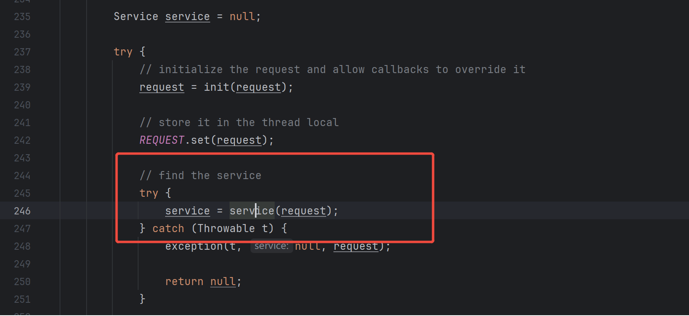
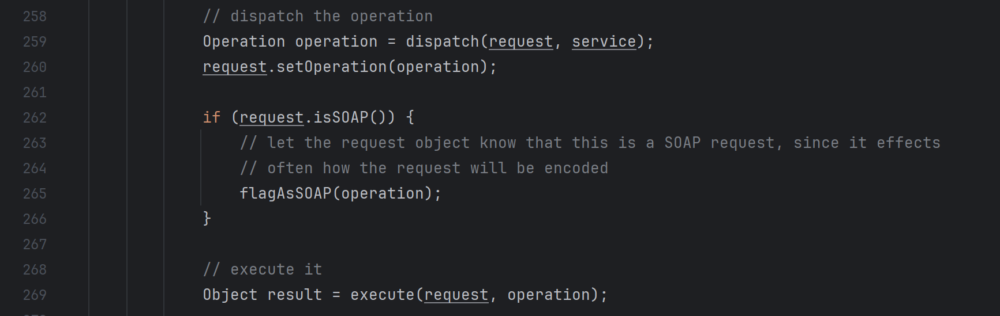

#### WMS服务请求参数说明

http://localhost:8083/geoserver/ne/wms?SERVICE=WMS&VERSION=1.1.1&REQUEST=GetMap&FORMAT=image/png&TRANSPARENT=true&STYLES=countries&LAYERS=ne:countries&exceptions=application/vnd.ogc.se_inimage&SRS=EPSG:4326&WIDTH=768&HEIGHT=370&BBOX=-270,-133.59375,270,126.5625

+ `SERVICE=WMS`表示请求的是`WMS`服务

+ `VERSION=1.1.1`表示请求的`WMS`服务版本

+ `REQUEST=GetMap`表示请求的服务操作

+ `FORMAT=image/png`表示请求的格式为`png`图片

+ `TRANSPARENT=true`表示支持透明，方便客户端多个地图叠加显示

+ `STYLES=countries`表示绘制使用的id为countries的样式

+ `LAYERS=ne:countries`表示绘制使用的数据为ne工作空间下的coutries数据

+ `SRS=EPSG:4326`表示使用WGS84坐标系

+ `WIDTH=768`表示绘制图片的宽度

+ `HEIGHT=370`表示绘制图片的高度

+ `BBOX=-270,-133.59375,270,126.5625`表示要绘制的数据矩形范围

#### WMS服务派发

`geoserver`使用了`SpringMVC`框架，请先了解[SpringMVC工作流程]()后再往下阅读。客户端发送wms请求到服务器后，由`DispatcherServlet`将该请求派发给`org.geoserver.ows.Dispatcher`对象进行处理。具体配置如下

+ `DispatcherServlet`配置,位于`src\web\app\src\main\webapp\WEB-INF\web.xml`

  ```xml
  <!-- spring dispatcher servlet, dispatches all incoming requests -->
  <servlet>
      <servlet-name>dispatcher</servlet-name>
      <servlet-class>org.springframework.web.servlet.DispatcherServlet</servlet-class>
  </servlet>
  ```

+ `HandlerMapping`配置,位于`src\wms\src\main\java\applicationContext.xml`

  ```xml
  <bean id="wmsURLMapping" 
      class="org.geoserver.ows.OWSHandlerMapping">
      <constructor-arg ref="catalog"/>
      <property name="alwaysUseFullPath" value="true"/>
      <property name="interceptors">
         <list>
             <ref bean="wmsCiteComplianceHack"/>
         </list>
      </property>
      <property name="mappings">
         <props>
             <prop key="/kml/icon/**/*">kmlIconService</prop>
            <prop key="/wms">dispatcher</prop>
            <prop key="/wms/*">dispatcher</prop>
         </props>
      </property>
  </bean>
  ```

+ `Handler`配置,位于`src\main\src\main\java\applicationContext.xml`

  ```xml
  <!--  dispatcher -->
  <bean id="dispatcher" class="org.geoserver.ows.Dispatcher"/>
  ```

#### WMS服务处理

`geoserver`中由`org.geoserver.ows.Dispatcher`对象处理所有的`ows`服务。该类继承自`org.springframework.web.servlet.mvc.AbstractController`并重载了`handleRequestInternal`方法。

1. 根据请求中的`SERVICE`和`VERSION`参数解析到对应的`org.geoserver.platform.Service`对象，针对示例请求，对应的`service`对象配置如下，位于`src\wms\src\main\java\applicationContext.xml`

   *此处使用了`ProxyFactoryBean`为`org.geoserver.wms.DefaultWebMapService`创建了代理用于处理日志和gwc缓存等，具体细节此处不展开说明*

   ```xml
   	<!-- wms service + descriptor -->
    	<bean id="wmsServiceTarget" class="org.geoserver.wms.DefaultWebMapService" lazy-init="false">
    	  <constructor-arg ref="wms"/>
         <property name="getCapabilities" ref="wmsGetCapabilities"/>
         <property name="describeLayer" ref="wmsDescribeLayer"/>
         <property name="getMap" ref="wmsGetMap"/>
         <property name="getFeatureInfo" ref="wmsGetFeatureInfo"/>
         <property name="getLegendGraphic" ref="wmsGetLegendGraphic"/>
         <property name="getStyles" ref="wmsGetStyles"/>
    	</bean>
    	
    	<bean id="wmsLogger" class="org.geoserver.ows.util.RequestObjectLogger">
         <constructor-arg type="java.lang.String" value="org.geoserver.wms"/>
       </bean>
       <bean id="wmsService2" class="org.springframework.aop.framework.ProxyFactoryBean">
         <property name="proxyInterfaces">
           <value>org.geoserver.wms.WebMapService</value>
         </property>
         <property name="targetName">
           <value>wmsServiceTarget</value>
         </property>
         <property name="interceptorNames">
           <list>
               <value>wmsLogger</value>
               <!-- allow any other advise defined elsewhere and named "wmsServiceInterceptor*" 
                    to be added to the interceptors list -->
               <value>wmsServiceInterceptor*</value>
           </list>
         </property>
       </bean>
       <alias name="wmsService2" alias="webMapService"/>
   
    	<bean id="wms-1_1_1-ServiceDescriptor" class="org.geoserver.platform.Service">
   		<constructor-arg index="0" value="wms"/>
   		<constructor-arg index="1" ref="wmsService2"/>
   		<constructor-arg index="2" value="1.1.1"/>
   	    <constructor-arg index="3">
             <list>
               <value>Capabilities</value>
               <value>GetCapabilities</value>
               <value>DescribeLayer</value>
               <value>GetFeatureInfo</value>
               <value>GetLegendGraphic</value>
               <value>GetMap</value>
               <value>Map</value>
               <value>reflect</value>
               <value>kml</value>
               <value>animate</value>
               <value>GetStyles</value>
             </list>
           </constructor-arg>
    	</bean>
   ```

   

2. 根据请求中的`REQUEST`参数从`Service`对象中解析到对应的`org.geoserver.platform.Operation`对象并执行对应方法，针对示例请求最终执行`org.geoserver.wms.DefaultWebMapService`的`getMap`方法并得到结果

   

3. 根据请求中的`FORMAT`参数写响应结果并返回

   