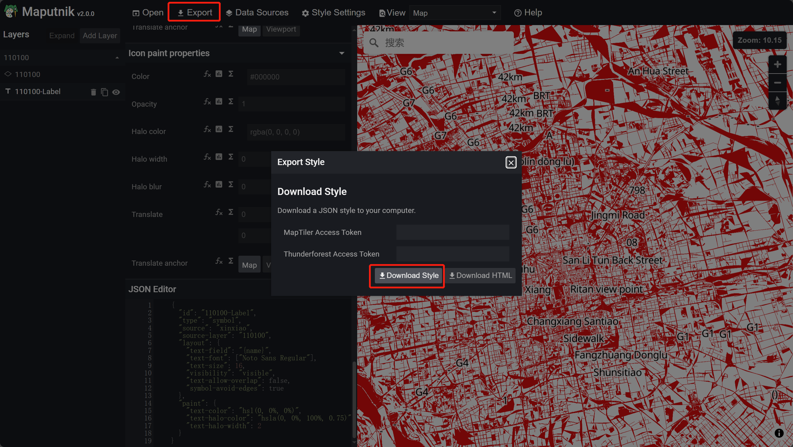

### 使用geoserver发布矢量瓦片服务

具体步骤参考[GeoServer发布矢量瓦片](https://blog.csdn.net/m0_50299172/article/details/141232794?spm=1001.2014.3001.5502)

### maputnik本地化部署

[maputnik代码仓库](https://github.com/maplibre/maputnik)

运行`npm install`安装依赖后运行`npm start`启动服务

访问[maputnik站点](http://localhost:8888)

### maputnik配图模板

`maputnik`提供了一些配图模板以供浏览参考


`maputnik`样式规范及常见制图效果配置方法参考[`maputnik`样式规范及常见制图效果配置]()

### 配置geoserver矢量瓦片样式

1. 添加`datasource`。此处`SourceType`选择`Vector(XYZ URLs)`，设置好`SourceID`后续添加图层会用到，矢量瓦片服务地址设置为`geoserver`发布的服务地址即可`http://localhost:8080/geoserver/xinxiao/gwc/service/wmts?REQUEST=GetTile&SERVICE=WMTS&VERSION=1.0.0&LAYER=xinxiao:110100&STYLE=&TILEMATRIX=EPSG:900913:{z}&TILEMATRIXSET=EPSG:900913&FORMAT=application/vnd.mapbox-vector-tile&TILECOL={x}&TILEROW={y}`

   

2. 添加图层。`source`设置为上一步添加的`SourceID`,`Source Layer`设置为`geoserver`发布服务的图层名称。

   

3. 修改填充色进行配图

   

4. 添加`Symbol`类型图层配置文本标注

   

5.  配置`name`字段作为文本标注。<font color=red>此处使用`maputnik`配置后显示的都是拼音，但是在`mapbox`中加载是正常的，有知道原因的小伙伴希望不吝赐教</font>

   

### MapBox加载浏览

1. 导出`maputnik`样式

   

2. MapBox加载预览

```html
<!DOCTYPE html>
<html>

<head>
  <meta charset='utf-8' />
  <title>加载第三方矢量切片</title>
  <meta name='viewport' content='initial-scale=1,maximum-scale=1,user-scalable=no' />
  <script src="https://api.mapbox.com/mapbox-gl-js/v2.1.0/mapbox-gl.js"></script>
  <link href="https://api.mapbox.com/mapbox-gl-js/v2.1.0/mapbox-gl.css" rel="stylesheet" />

  <style>
    body {
      margin: 0;
      padding: 0;
    }

    #map {
      position: absolute;
      top: 0;
      bottom: 0;
      width: 100%;
    }
  </style>
</head>

<body>
  <div id='map'></div>
  <script>
    mapboxgl.accessToken = 'your accessToken';
      //替换为maputnik导出的样式即可
    var mapStyle = {
  "version": 8,
  "name": "Empty Style",
  "metadata": {"maputnik:renderer": "mlgljs"},
  "sources": {
    "xinxiao": {
      "type": "vector",
      "tiles": [
        "http://localhost:8080/geoserver/xinxiao/gwc/service/wmts?REQUEST=GetTile&SERVICE=WMTS&VERSION=1.0.0&LAYER=xinxiao:110100&STYLE=&TILEMATRIX=EPSG:900913:{z}&TILEMATRIXSET=EPSG:900913&FORMAT=application/vnd.mapbox-vector-tile&TILECOL={x}&TILEROW={y}"
      ],
      "minzoom": 0,
      "maxzoom": 14
    }
  },
  "sprite": "",
  "glyphs": "https://orangemug.github.io/font-glyphs/glyphs/{fontstack}/{range}.pbf",
  "layers": [
    {
      "id": "110100",
      "type": "fill",
      "source": "xinxiao",
      "source-layer": "110100",
      "paint": {"fill-color": "rgba(228, 14, 14, 1)"}
    },
    {
      "id": "110100-Label",
      "type": "symbol",
      "source": "xinxiao",
      "source-layer": "110100",
      "layout": {
        "text-field": "{name}",
        "text-font": ["Noto Sans Regular"],
        "text-size": 16,
        "visibility": "visible",
        "text-allow-overlap": false,
        "symbol-avoid-edges": true
      },
      "paint": {
        "text-color": "hsl(0, 0%, 0%)",
        "text-halo-color": "hsla(0, 0%, 100%, 0.75)",
        "text-halo-width": 2
      }
    }
  ],
  "id": "xom5oid"
}

    var map = new mapboxgl.Map({
      container: 'map',
      style: mapStyle,
      zoom: 14,
      center: [116.08, 40.54]
    });
  </script>

</body>

</html>
```

