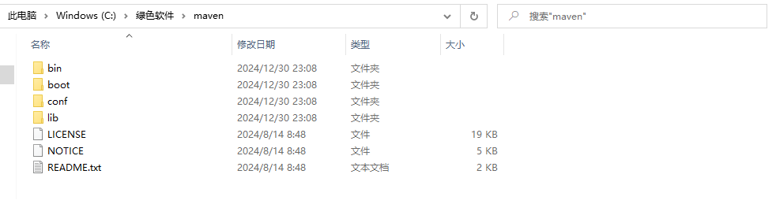
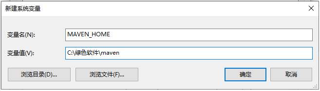
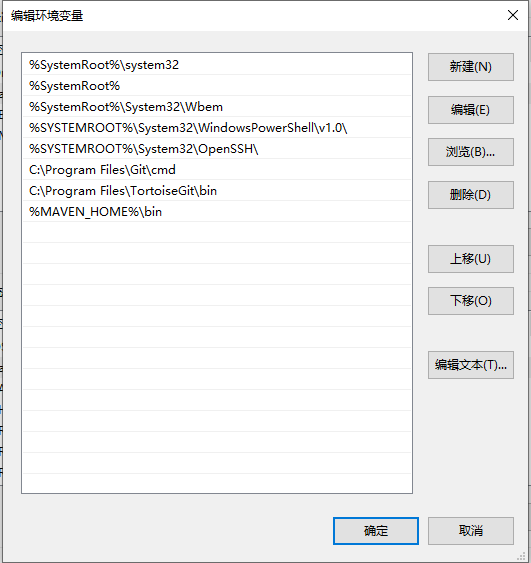
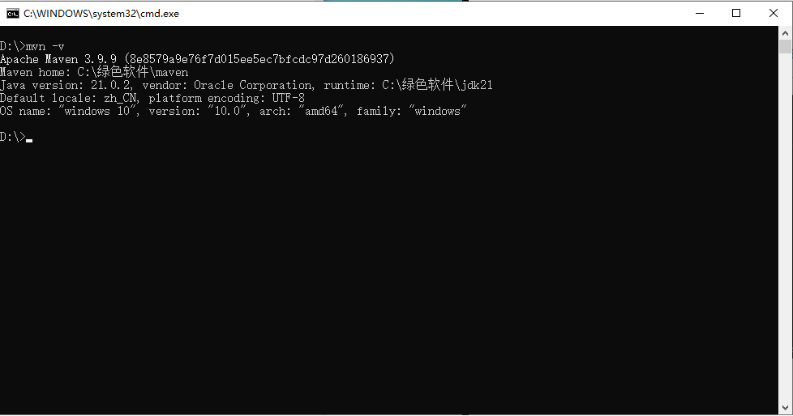
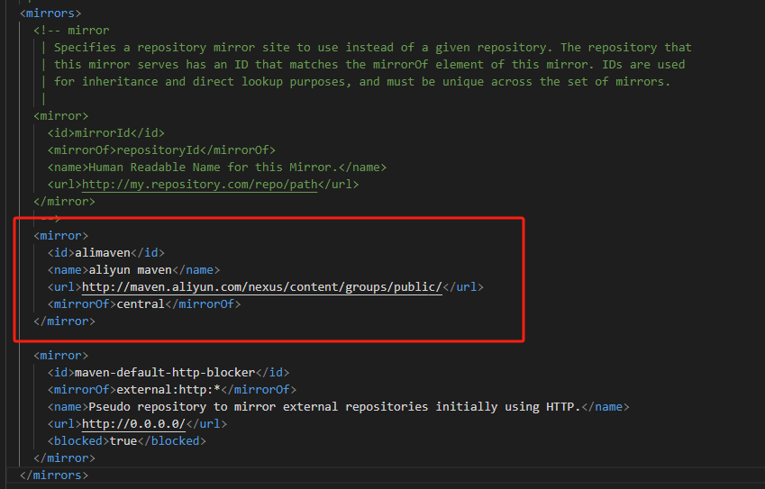
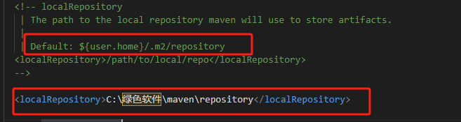
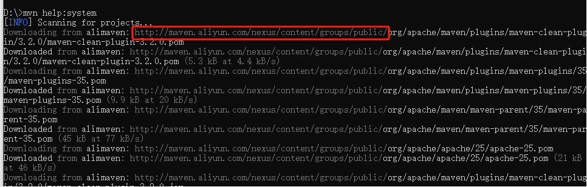
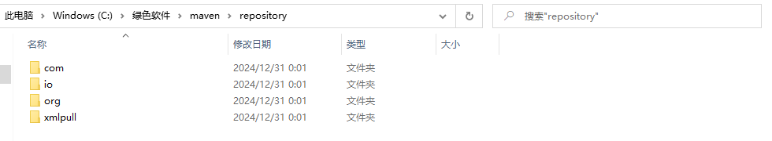

### maven安装

1. 下载[maven](https://pan.baidu.com/s/16gzyC6giI7HTfU9ROHkyiw?pwd=be42)并解压,我的目录是`C:\绿色软件\maven`

   

2. 配置MAVEN_HOME环境变量为maven安装目录

   

3. 在系统变量`path`中添加`%MAVEN_HOME%\bin`

   

4. 打开命令行窗口输入`mvn -v`，出现如下`maven`版本信息证明安装配置成功

   

### maven配置

#### 配置国内镜像

`maven`默认使用国外服务器下载依赖，速度较慢，可以配置阿里云等国内镜像加速依赖下载

打开`conf`目录下的`settings.xml`文件添加如下标签

```
<mirror>  
    <id>alimaven</id>  
    <name>aliyun maven</name>  
    <url>http://maven.aliyun.com/nexus/content/groups/public/</url>  
    <mirrorOf>central</mirrorOf>          
</mirror>
```



#### 本地仓库配置

`maven`的默认本地仓库位置是用户目录下的`.m2/repository`文件夹,我们可以配置一个指定的目录方便管理

1. 新建目录作为本地仓库目录，我的目录是`C:\绿色软件\maven\repository`
2. 打开`conf` 目录下的`settings.xml` 添加如下标签

```
<localRepository>C:\绿色软件\maven\repository</localRepository>
```



3. 打开命令行窗口输入`mvn help:system`验证国内镜像及本地仓库是否配置成功



