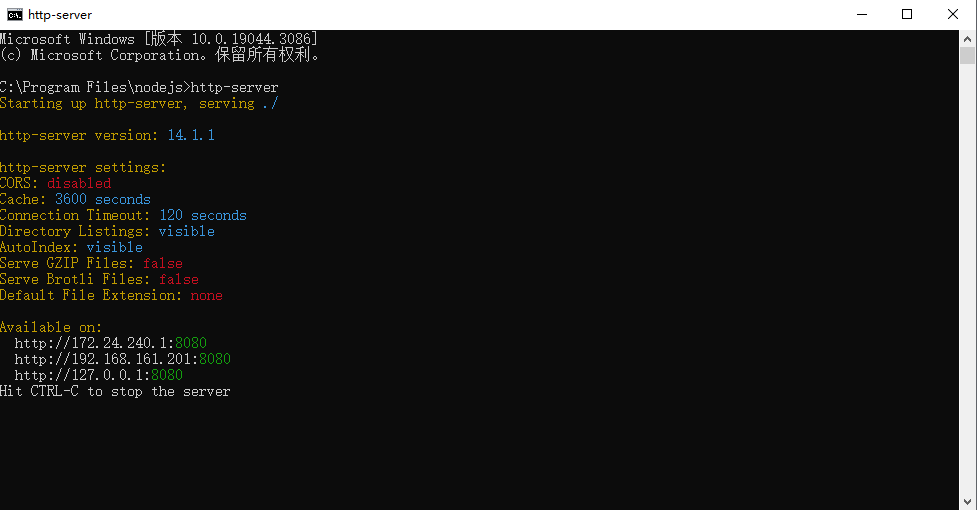

### node安装

1. 下载[node](https://nodejs.org/zh-cn)并安装
2. 打开命令行窗口输入`node -v`出现如下`node`版本信息证明安装成功


### node配置

#### 配置淘宝镜像

`node`默认使用国外服务器下载依赖，可以配置淘宝等国内镜像加速下载

1. 打开命令行窗口输入如下命令进行配置

   ```
   npm config set registry https://registry.npmmirror.com
   ```

   

2. 输入如下命令查看是否配置成功

   ```
   npm config get registry
   ```

   

#### 修改缓存存放路径

1. 打开命令行窗口输入如下命令查看缓存默认存放路径

   ```
   npm get cache
   ```

2. 创建缓存存放文件夹并，输入如下命令修改缓存存放路径

      ```
      npm config set cache "C:\Program Files\nodejs\node_cache"
      ```

3. 再次查看缓存存放路径验证是否配置成功

   

#### 修改模块全局安装路径

1. 查看默认安装路径

   ```
   npm get prefix
   ```

2. 创建文件并修改全局安装路径

   ```
   npm config set prefix "C:\Program Files\nodejs\node_global"
   ```

3. 再次查看全局安装路径验证是否配置成功

   

4. 配置全局安装路径到环境变量

   

   

#### 安装`http-server`验证是否配置成功

1. 打开命令行窗口运行如下命令全局安装`http-server`模块

   ```
   npm install http-server -g
   ```

   此处安装如果出现权限问题，右键`nodejs`文件在如下属性界面修改权限即可

   

2. 安装完成查看配置的缓存下载目录和全局安装目录，验证是否配置成功

   

3. 打开命令行窗口运行如下命令验证`http-server`是否安装成功

   ```
   http-server
   ```

   

### 常见问题

1. `vscode`中运行` npm install`报禁止运行脚本错误

   

   解决方案：

   以管理员身份打开`powershell`运行`set-executionpolicy remotesigned`即可

   ```
   set-executionpolicy remotesigned
   ```

   